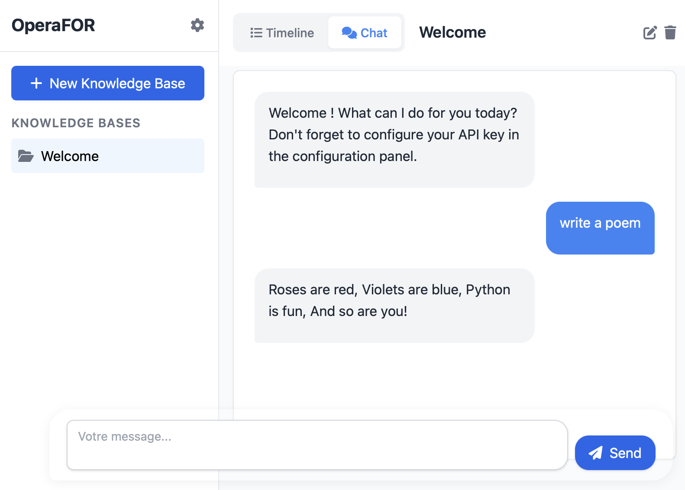

# OperaFOR

OperaFOR is a minimalist graphical interface for LLM and RAG agents, designed to provide fast and simple access to powerful search tools via an agentic logic. Its streamlined architecture—just a single HTML file and a single Python file—enables rapid iteration and creativity.



## ✨ Main Features

- **Minimalist interface**: just one HTML page, less than 10 Python files. Minimal number of dependencies.
- **Base default search tools** for reading, writing and editing files in the folder
- **Smart context injection**: automatically shows current sandbox files to the LLM without cluttering conversation history
- **Automatic URL handling**: paste file paths or web URLs in your messages and they'll be automatically downloaded/copied to your sandbox
- **Local execution**: runs with pywebview and can be packaged with pyinstaller.
- **A task-oriented experience**: the timeline interface emphasizes tasks, making it clear that answers are not instantaneous (unlike a chatbot).
- **Organize your work**: manage sandboxes/conversations for different sessions.
- **Integrated Git system**: sandboxes are versioned conversations, allowing rollback and version control of your research sessions.

## 🚀 Development Installation


Install the required dependencies:

```bash
uv pip install .
```
    
To start the application in development mode :

```bash
uv run main.py
```

The interface will automatically open in a pywebview window.

## 📦 Windows Executable

A standalone Windows executable is available on the [GitHub Releases page](https://github.com/FOR-sight-ai/OperaFOR/releases) — no Python installation required!


## 🛠️ Usage

- Configure your API key and LLM settings in the configuration panel.
- Create sandboxes (similar to conversations) to organize your tasks or research.
- Each sandbox is versioned using an integrated Git system, enabling you to rollback, track changes, and manage versions of your conversations.
- Launch requests, follow their progress, and view results in a task-oriented timeline interface.

### Smart Features

**Automatic File Context**: When you have files in your sandbox, the LLM automatically sees a list of available files without you needing to ask. This helps the LLM understand what's available to work with.

**URL Auto-Import**: Simply paste URLs in your messages and they'll be automatically imported to your sandbox:
- **Web URLs**: `https://example.com/page.html` → downloaded to `downloads/example.com/page.html`
- **File paths**: `/path/to/file.txt` or `C:\Users\file.txt` → copied to `imported/file.txt`
- **Directories**: Entire folders are copied recursively (excluding `.git` and `__pycache__`)

Example message:
```
Analyze https://github.com/user/repo/blob/main/README.md and compare it with /Users/me/Documents/notes.txt
```
Both files will be automatically downloaded/copied to your sandbox before the LLM processes your request.


## 📁 Project Structure

- `main.py`: FastAPI server, sandboxes management, custom agentic logic, pywebview launcher.
- `index.html`: unique, responsive, task-oriented user interface.


## Acknowledgement

This project received funding from the French ”IA Cluster” program within the Artificial and Natural Intelligence Toulouse Institute (ANITI) and from the "France 2030" program within IRT Saint Exupery. The authors gratefully acknowledge the support of the FOR projects.

## 📜 License

This project is open source, under the MIT license.
